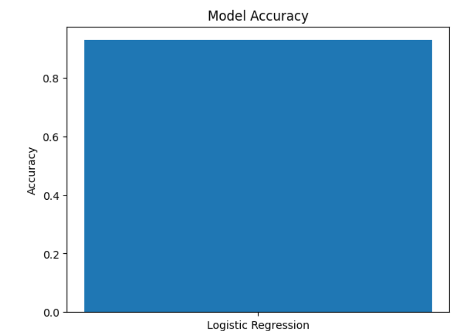
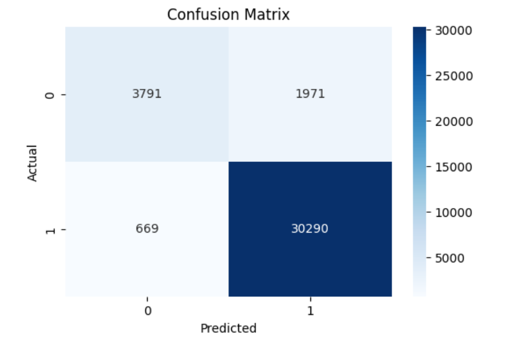
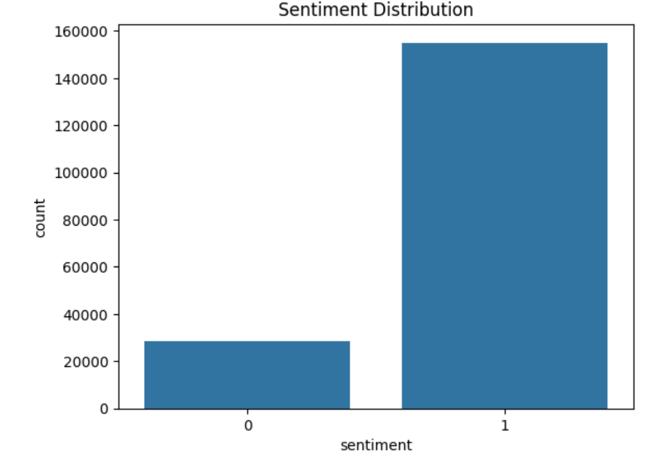

# Amazon Review Sentiment Classification

## Author
- **Name:** Roshan Ali
- **Project Type:** Machine Learning / NLP
- **Model Used:** Logistic Regression
- **Language:** Python

---

## Project Overview

This project performs sentiment classification on Amazon product reviews using Machine Learning techniques.

The model predicts whether a review is:

- Positive Review
- Negative Review

The dataset used contains Amazon Video Games reviews.

---

## Technologies Used

- Python
- Pandas
- NumPy
- Matplotlib
- Seaborn
- Scikit-learn
- Jupyter Notebook

---

## Machine Learning Workflow

1. Load Dataset
2. Data Cleaning
3. Text Preprocessing
4. TF-IDF Vectorization
5. Train/Test Split
6. Logistic Regression Model
7. Accuracy Evaluation
8. Graph Visualization

---

## Model Accuracy

**Accuracy Achieved:** `92.81%`

---

## Graphs and Results

### Accuracy Graph



---

### Confusion Matrix



---

### Sentiment Distribution



---

## Project Structure

```bash
Amazon-Review-Classification/
│
├── amazon_review_classification.ipynb
├── README.md
├── requirements.txt
└── images/
    ├── accuracy_graph.png
    ├── confusion_matrix.png
    └── sentiment_distribution.png
